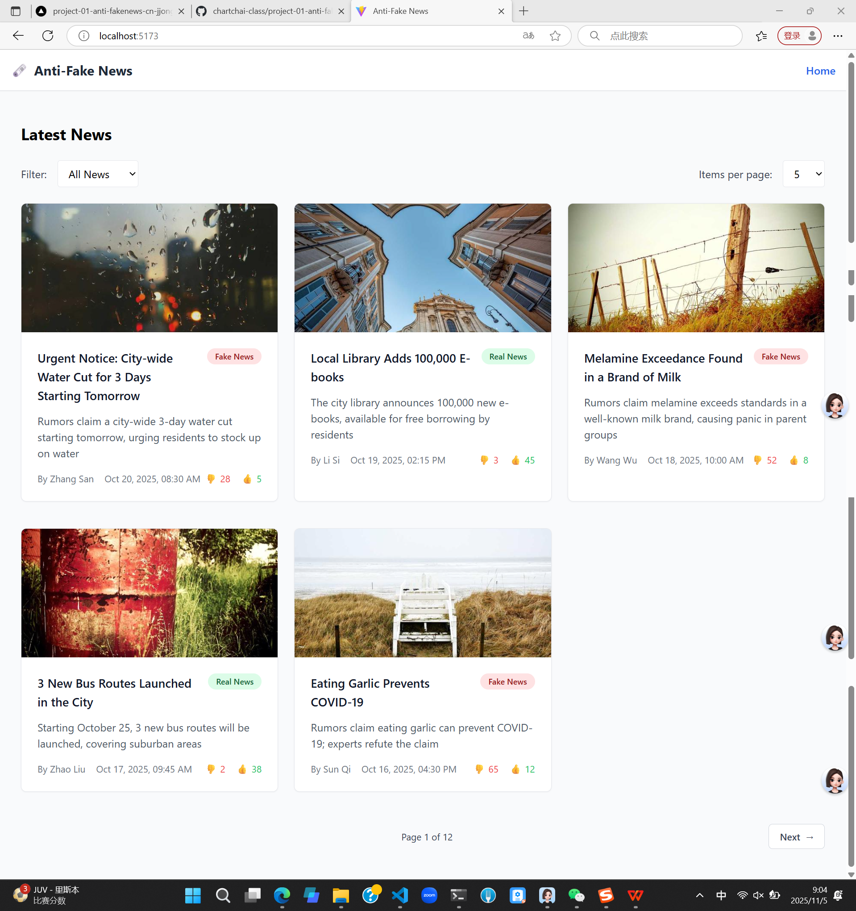
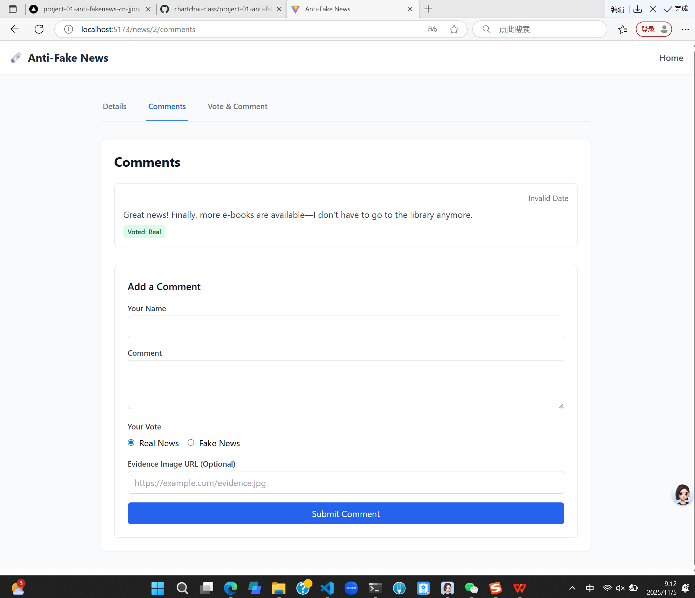
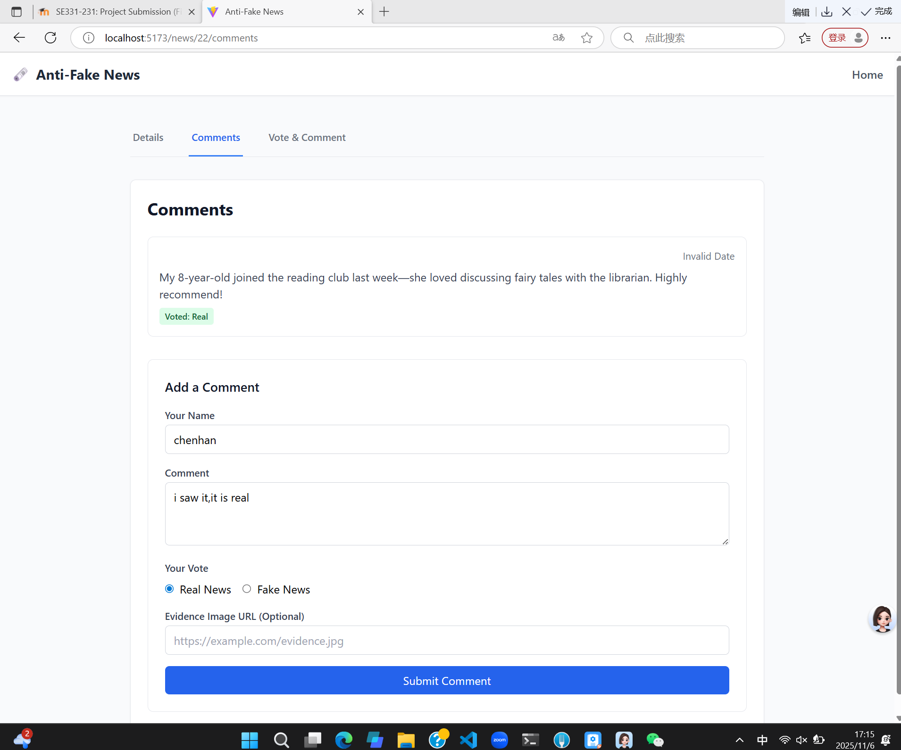
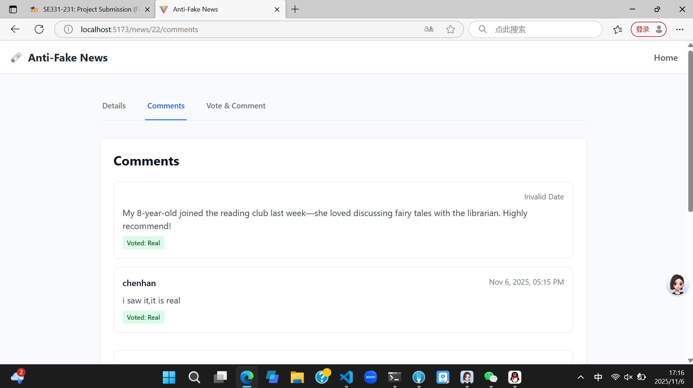
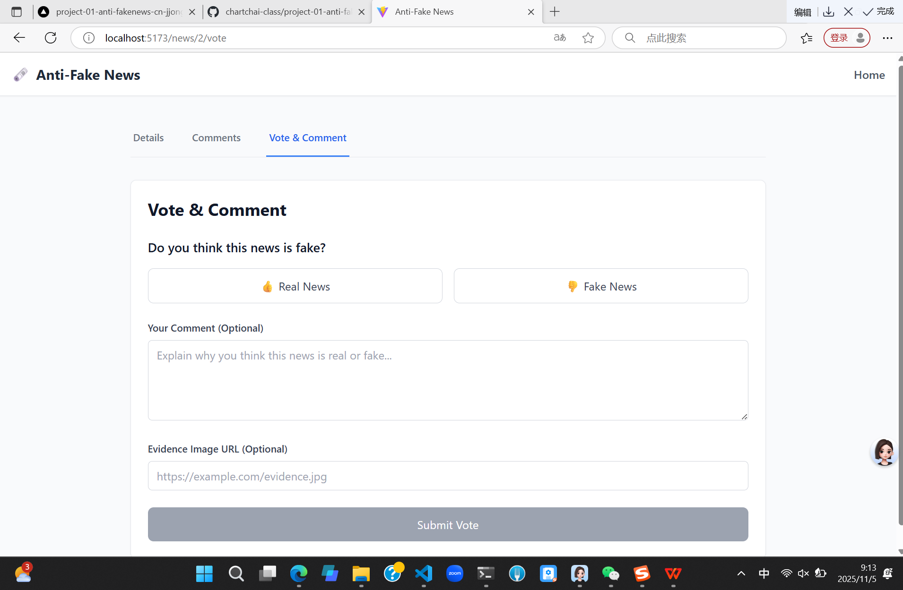
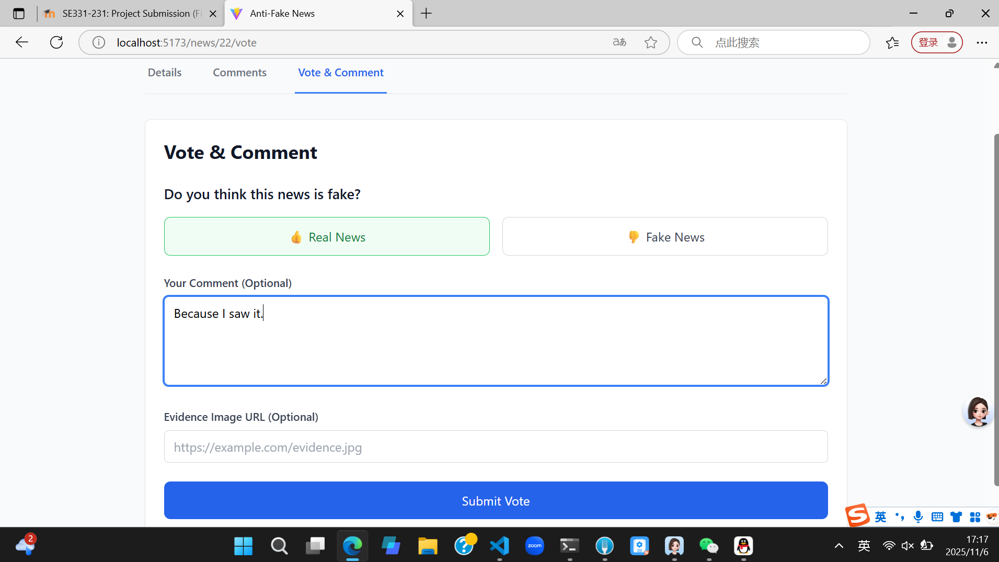
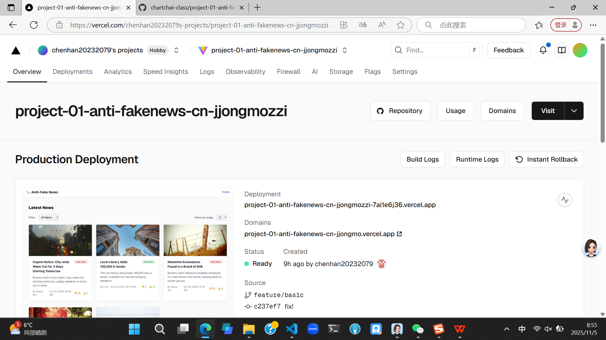
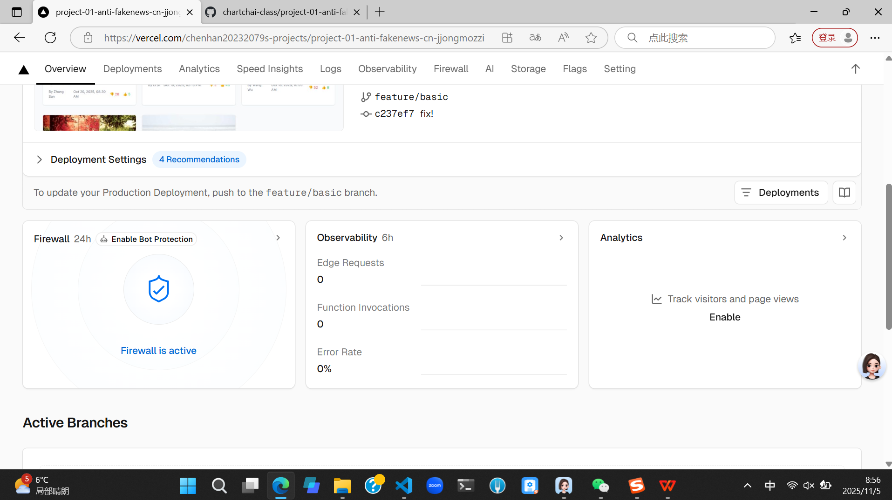
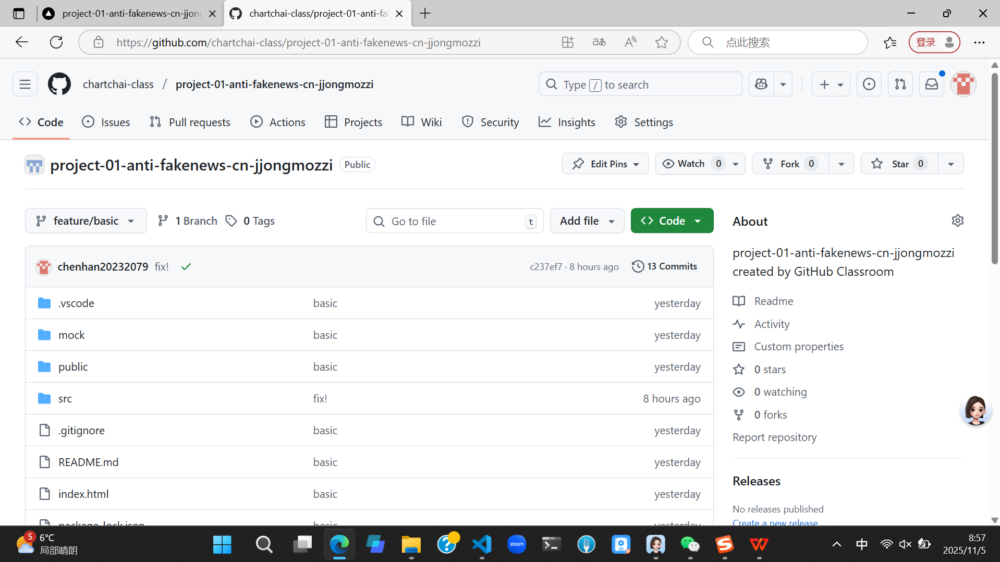
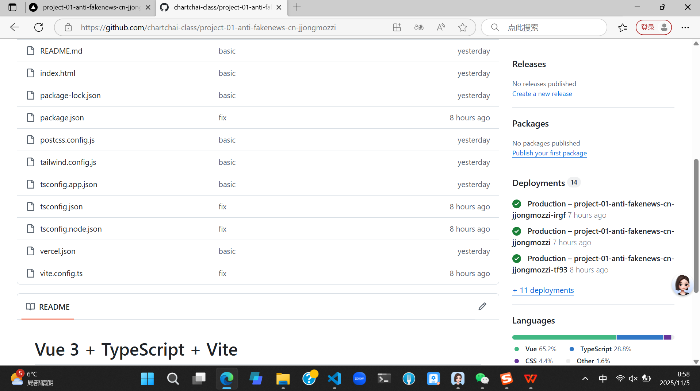

Social Anti-Fake News Platform

Group Name：project-01-anti-fakenews-cn-jjongmozzi

project leader: Chen Han  20232079
project member: Li Yiheng   20232047
project member：Huang Qiuyue  20232074

Team Members and Contributions (Including Coding/Deployment/Git Operations)：

Chen Han (Team Leader) - Student ID: 20232079 (80% workload)

1. Project Architecture and Foundation
Initialized project structure (created Vue+TypeScript project with Vite)
Configured core dependencies (Vue Router, Pinia, Axios, etc.) and environment variables
Designed global type system (defined core interfaces like News, Comment, Vote)
Built basic routing structure and layout components (App.vue, Layout.vue)
2. Core Function Development
Implemented the entire news module:
News list component (NewsList.vue) and pagination
News detail page (NewsDetailView.vue) and data rendering
News data management (newsStore.ts) and API service (newsService.ts)
Led the development of page interaction logic (pull-to-refresh, filters, loading status)
3. Deployment and Git Operations
Configured Vercel deployment parameters (vite.config.ts optimization, build command settings)
Created GitHub repository, initialized the project, and set branch protection rules
Wrote deployment documentation and resolved type checking and dependency conflicts during deployment
Merged team members' code and conducted final testing and launch
4. Global Optimization
Unified code specifications and fixed type checking issues
Optimized page loading performance and user experience
Handled cross-browser compatibility issues
5.some parts of Comment Function Development
6.some parts of Auxiliary Function Implementation
7.some parts of Voting and Interaction Function Development
8.some parts pf UI and Experience Optimization

codes written by ChenHan20232079:
/package.json
/vite.config.ts
/tsconfig.json
/src/main.ts
/src/App.vue
/src/router/index.ts
/src/router/routes.ts	
/src/stores/index.ts
/src/stores/newsStore.ts
/src/views/Home.vue
/src/components/news/NewsList.vue
/src/components/common/Pagination.vue
/src/views/NewsDetail.vue
/src/components/news/NewsHeader.vue
/src/components/news/NewsContent.vue
/public/db.json
/src/api/newsApi.ts
/vercel.json
/src/stores/commentStore.ts
/src/components/comment/CommentList.vue
/src/stores/voteStore.ts
/src/components/vote/VoteButtonGroup.vue
/src/components/news/NewsCard.vue

Li Yiheng - Student ID: 20232047 (10% workload)

1. other parts of Comment Function Development
2. other parts of Auxiliary Function Implementation

codes written by Li Yiheng20232047:
/src/components/comment/CommentForm.vue
/src/views/NewsDetail.vue
/src/types/comment.ts

Huang Qiuyue - Student ID: 20232074 (10% workload)

1. other parts of Voting and Interaction Function Development
2. other parts of UI and Experience Optimization

codes written by Huang Qiuyue20232074:
/src/views/NewsDetail.vue
/src/components/common/Button.vue
/src/components/common/Card.vue

Here are the details of our project:

Project Overview：
This project is a social media platform for anti-fake news, integrating news browsing, authenticity voting, and comment interaction. Users can access news, participate in judging news authenticity, post comments, and exchange opinions to jointly resist the spread of false information. The platform is built with modern frontend technologies and supports responsive design for various devices.

Technology Stack：
Core Framework: Vue 3 (Composition API)
State Management: Pinia
Routing: Vue Router
Type Checking: TypeScript
HTTP Client: Axios
Build Tool: Vite
Deployment Platform: Vercel
Code Hosting: GitHub

Core Features：
News Module: News list display, detail viewing, category filtering
Voting Module: credible/not credible voting for news authenticity and result display
Comment Module: Post comments, view comment lists, and comment interaction
Global Features: Page navigation, loading status prompts, error handling

Deployment and Access
Online Deployment URL: https://project-01-anti-fakenews-cn-jjongmo.vercel.app
GitHub Repository URL: https://github.com/chartchai-class/project-01-anti-fakenews-cn-jjongmozzi.git
Presentation video URL:https://pan.baidu.com/s/1BTxPkioLtWSg-ExP1MdeNQ?pwd=dpe3 
If you need to enter the extraction code to view the video, the video extraction code is: dpe3

Local Running Steps
Clone the repository: git clone [repository URL]
Install dependencies: npm install
Start development server: npm run dev
Build for production: npm run build

Project screenshot display:

five news items per page:

five news items per page and toggle between the front and back pages:

ten news items per page:

ten news items per page and toggle between the front and back pages:

twenty news items per page:

twenty news items per page and toggle between the front and back pages:

filter out fake news:

filter out real news:

news details page display:

comment function page display:

user posts comments:

user posted comment successfully:

vote and comment function page display:

users vote and comment:

voted and commented successfully；

Vercel screenshot of successful deployment page：

Github screenshot display of warehouse page:

